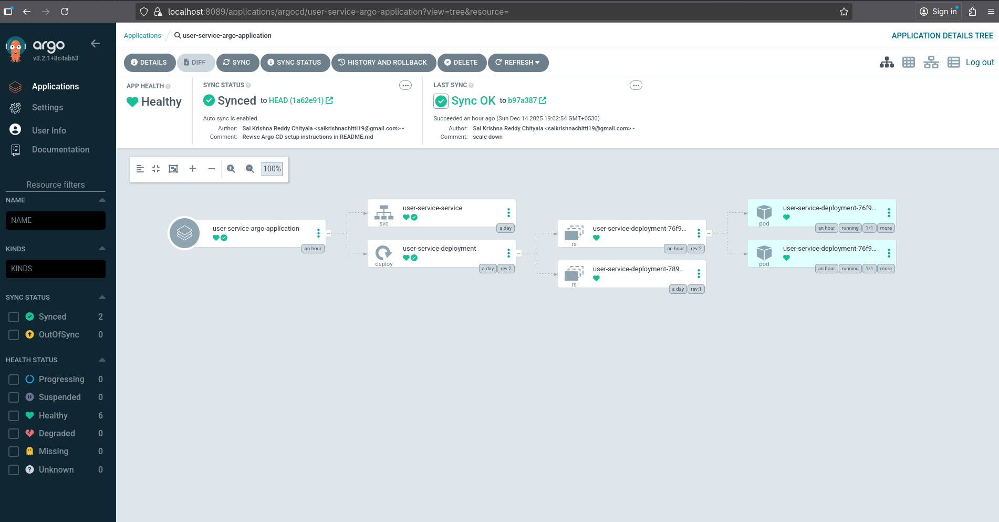

# Argo CD – Quick Setup Guide

This repository contains Kubernetes resources for a service managed and continuously synchronized by an Argo CD agent running on a Kubernetes cluster.

Argo CD follows the **GitOps** model, where Git is the single source of truth for your cluster state.

---

## Git <-> Argo CD Agent <-> Kubernetes


---

## Prerequisites

- Kubernetes cluster (v1.19+ recommended)
- `kubectl` configured to access the cluster
- Internet access to pull Argo CD manifests
- GitHub repository with Kubernetes manifests

---

## Install Argo CD on Kubernetes

### 1. Create Argo CD namespace

```bash
kubectl create namespace argocd
```

### 2. Install Argo CD components
Apply the official Argo CD installation manifest:
```bash
kubectl apply -n argocd \
  -f https://raw.githubusercontent.com/argoproj/argo-cd/stable/manifests/install.yaml
```

Verify installation:
```bash
kubectl get pods -n argocd
```

## Access Argo CD UI (Local)
Argo CD server exposes ports 80 and 443.
Use port-forwarding to access the UI locally.

```bash
kubectl port-forward -n argocd svc/argocd-server 8089:443
```

Open in browser:
https://localhost:8089

Username: admin

Retrieve Initial Admin Password
The initial admin password is stored in a Kubernetes secret:
```
argocd-initial-admin-secret
```

Retrieve and decode the password:
```bash
kubectl get secret -n argocd argocd-initial-admin-secret \
  -o jsonpath="{.data.password}" | base64 --decode
```

## Configure Argo CD Application
Argo CD applications define:

Source: Git repository containing Kubernetes manifests
Destination: Kubernetes API server and namespace

Sample Config:
```yaml
apiVersion: argoproj.io/v1alpha1
kind: Application
metadata:
  name: demo-app
  namespace: argocd
spec:
  project: default
  source:
    repoURL: https://github.com/your-org/your-repo.git
    targetRevision: main
    path: manifests
  destination:
    server: https://kubernetes.default.svc
    namespace: default
  syncPolicy:
    automated:
      prune: true
      selfHeal: true
```

Apply the application:
```bash
kubectl apply -f application.yaml
```

## Verify Application in Argo CD UI



After applying the application:

Open Argo CD UI -> Navigate to Applications -> Select your application

You should see:
- Sync status
- Health status
- Deployments
- Pods
- Services

## GitOps Workflow

- Argo CD polls the configured Git repository every 3 minutes (default)
- Any change to Kubernetes manifests in Git triggers synchronization
- Cluster state is automatically reconciled to match Git
- Manual kubectl changes are reverted if selfHeal is enabled
